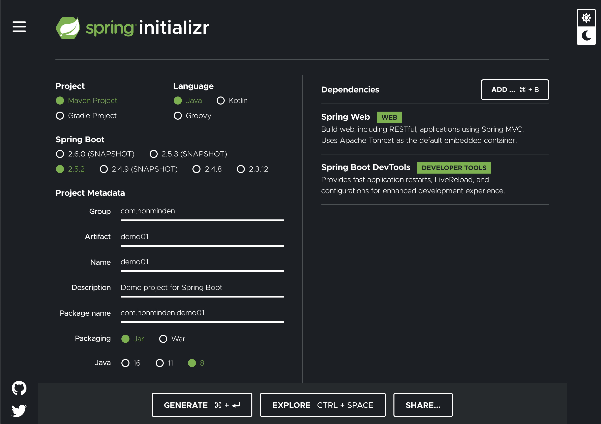

# Spring项目搭建踩坑经验

总结一下从头开始搭建一个Spring项目过程中踩的一些坑和其它经验。

---

## 创建项目：Spring模板

如果你用Intellij IDEA Ultimate这类集成了Spring的IDE，那么可以直接找到模板创建一个新项目。

但如果你用的是Intellij IDEA CE（社区版）这种没有集成Spring的开发工具，那么就需要自己编写配置文件或者导入模板。

这里推荐到官网的[spring initializer](https://start.spring.io/)下载模板。



这里可以进行各种配置，比如右边的依赖可以添加Spring Web（网络开发相关工具）以及Spring Boot Devtools（启用热部署），下面可以选JDK版本等等。

---

## 热部署：IDEA CE的Smart Tomcat插件

如果你用的是Intellij IDEA Ultimate，那么可以直接进行热部署，不需要多花功夫。

而当你用Intellij IDEA CE进行热部署时，则首先要下载Tomcat，之后需要在IDEA里下载一个叫做**Smart Tomcat**的插件，配置好就可以使用热部署了。

---

## 打包部署：war包部署的各种问题

假设你已经写完了一个Web项目，需要打包部署到服务器上，有两种选择：使用jar包或者war包。

jar包的部署很简单，因为Spring Web已经内置了Tomcat，可以直接通过java -jar命令部署。

war包的部署就比较麻烦了。首先要修改配置，有两种办法：

一、在项目开始时就确定要使用war包部署，那么可以直接在spring initializer里设置使用war包，导出的模板可以直接用于war包部署。

二、假设一个使用jar包部署的项目临时要改成用war包部署，那么需要修改下面几项配置：
1. 修改pom.xml，加入packaging行并加入一个provided的依赖（用来屏蔽内置Tomcat）
```xml
<groupId>com.honminden</groupId>
<artifactId>demo01</artifactId>
<version>0.0.1-SNAPSHOT</version>
<name>demo01</name>
<description>Demo project for Spring Boot</description>
<properties>
    <java.version>1.8</java.version>
</properties>
<packaging>war</packaging> <!-- mvn package generates a war file -->
```
```xml
<dependency>
    <groupId>org.springframework.boot</groupId>
    <artifactId>spring-boot-starter-tomcat</artifactId>
    <scope>provided</scope>
</dependency>
```
2. 创建一个Initializer类，为Tomcat指定程序入口

ServletInitializer.java
```java
package com.honminden.demo02;

import org.springframework.boot.builder.SpringApplicationBuilder;
import org.springframework.boot.web.servlet.support.SpringBootServletInitializer;

public class ServletInitializer extends SpringBootServletInitializer {

	@Override
	protected SpringApplicationBuilder configure(SpringApplicationBuilder application) {
		return application.sources(Demo02Application.class);
	}

}
```
之后将导出的war包放在Tomcat的webapps目录下即可

### 一个大坑：目前不要使用Tomcat 10

之前我部署war包后发现报错404，很长时间都没找到原因，后来终于发现是因为Tomcat的版本问题。似乎Tomcat 10并不兼容当前的Spring（至少到2021.07.02依然如此），建议暂时先使用Tomcat 9来部署war包。